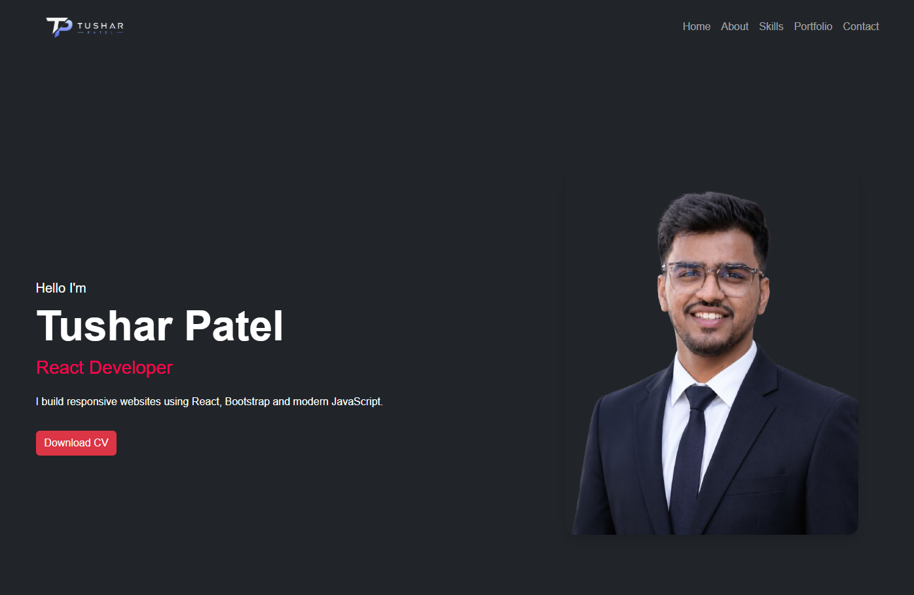

<div align="center">

# 💼 Tushar Patel - React Portfolio Website

A modern, responsive personal portfolio built with **React**, **Bootstrap**, **Vite**, and **CSS**.


</div>

---

# 📸 Preview

<p align="center">
  
</p>

---

# 🌐 Live Demo

<p align="center">
  <a href="https://protfolio-project-three.vercel.app/" target="_blank">
    
  </a>
</p>

🔗 **Website:** [https://your-live-demo-url.com](https://protfolio-project-three.vercel.app/)

---

# ✨ Features

- 🎨 Modern Dark UI
- 📱 Fully Responsive Design
- ⚡ Fast Performance with Vite
- 🧭 Smooth Navigation
- 👨‍💻 About Me Section
- 💼 Services Section
- 🛠️ Skills Showcase
- 🎓 Education & Experience Timeline
- 🚀 Portfolio Projects
- 📞 Contact Form
- 🔗 Social Media Integration

---

# 🛠️ Tech Stack

| Technology | Purpose |
|------------|---------|
| React.js | Frontend Framework |
| Bootstrap 5 | Responsive Layout |
| CSS3 | Custom Styling |
| JavaScript (ES6+) | Application Logic |
| React Icons | Icons |
| Vite | Development & Build Tool |

---

# 📂 Project Structure

```text
portfolio/
│
├── public/
├── src/
│   ├── assets/
│   ├── Component/
│   │   ├── Navbar.jsx
│   │   ├── Hero.jsx
│   │   ├── About.jsx
│   │   ├── Services.jsx
│   │   ├── Skills.jsx
│   │   ├── Resume.jsx
│   │   ├── Portfolio.jsx
│   │   ├── Contact.jsx
│   │   └── Footer.jsx
│   ├── App.jsx
│   ├── App.css
│   └── main.jsx
│
├── package.json
├── vite.config.js
└── README.md
```

---

# 🚀 Installation

Clone the repository

```bash
git clone https://github.com/tushi66/Protfolio-Project.git
```

Move to the project folder

```bash
cd Protfolio-Project
```

Install dependencies

```bash
npm install
```

Start the development server

```bash
npm run dev
```

Open

```
http://localhost:5173
```

---

# 📦 Production Build

```bash
npm run build
```

Preview

```bash
npm run preview
```

---

# 📱 Responsive Design

✔ Desktop

✔ Laptop

✔ Tablet

✔ Mobile

---

# 📹 Presentation Video

https://drive.google.com/drive/folders/1cXMnZ2B_UNTffGbOyV_TWomRcT9C2ew_?usp=sharing

---

# 📬 Contact

👨 **Tushar Patel**

📧 Email: tusharpatel051997@gmail.com

💼 LinkedIn: https://www.linkedin.com/in/tusharpatel8066/

🐙 GitHub: https://github.com/tushi66

📷 Instagram: https://instagram.com/ptushar66

📍 Gujarat, India

---

# ⭐ Support

If you like this project, please consider giving it a ⭐ on GitHub.

---

<div align="center">

### Made with ❤️ using React, Bootstrap & Vite

</div>n
